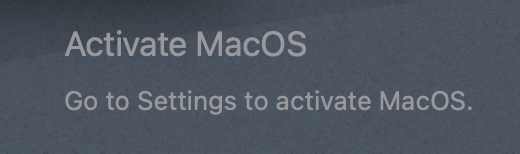

<div align="center">
	
	<h1>🚀 Activate MacOS App</h1>
	
	
</div>

<br />

> Version: **1.1.0**

---

# Table of Contents

- [🎉 About](#-about)
- [🎯 Purpose](#-purpose)
- [🚀 Getting Started](#-getting-started)
  - [Installing the App](#installing-the-app)
    - [Install with Homebrew](#install-with-homebrew)
    - [Download the DMG](#download-the-dmg)
    - [Build the app](#build-the-app)
  - [Launching the App](#launching-the-app)
  - [Stopping the App](#stopping-the-app)
- [✨ Features](#-features)
- [📸 Screenshot](#-screenshot)
- [🤔 Troubleshooting](#-troubleshooting)
- [📧 Contact](#-contact)

# 🎉 About

Welcome to the **Activate MacOS** app! 🎉 This fun little app is designed to mimic the activation message you might see on Windows when you don't have a valid license. A playful nod to our friends using Windows!

# 🎯 Purpose

This app creates a window on your macOS desktop with a message that says:

- **"Activate MacOS"**
- **"Go to Settings to activate MacOS."**

It's a humorous way to remind you of the activation screens found in other operating systems. 😉

# 🚀 Getting Started

## Installing the App

### Install with Homebrew

Install the app using the following command:

```bash
 brew install zarox28/apps/activate
```

### Download the DMG

1. Download the prebuilt DMG from the [Releases](https://github.com/Zarox28/Activate/releases) page.

2. Open the DMG file and drag the app to your Applications folder.

### Build the app

1. Open Terminal and run the following command:
   ```bash
   git clone https://github.com/Zarox28/Activate.git
   ```
2. Open it in Xcode.

3. Build the project.

4. Go to the Products folder in the project navigator.

5. Move the app to your Applications folder.

## Launching the App

1. **Run the App**:

   - Open the app from your Applications folder or search for it using Spotlight.

2. **Enjoy the View**:
   - You should see a small, borderless window in the bottom-right corner of your screen displaying the activation message.

## Stopping the App

1. **Open Terminal**:

   - Launch the Terminal app from your Applications folder or search for it using Spotlight.

2. **Find the Process ID**:

   - Use the following command to find the process ID (PID) of the app:
     ```bash
     ps aux | grep Activate
     ```
   - Note the PID of the `Activate` process.

3. **Kill the Process**:
   - Execute the following command to stop the app:
     ```bash
     kill -9 <PID>
     ```
   - Replace `<PID>` with the actual process ID you found earlier.

# ✨ Features

- **Borderless Window**: The app features a borderless window that blends seamlessly with your desktop.
- **No Window Buttons**: All standard window buttons (minimize, zoom, close) are hidden to keep it sleek.
- **Floating Window**: The window stays above other windows, ensuring you don't miss it!

# 📸 Screenshot

<div align="center">
	
</div>

# 🤔 Troubleshooting

- **Window Not Appearing**: Ensure you run the app from Xcode or use the prebuilt DMG. If the window doesn't appear, try restarting the app.
- **Can't Kill the Process**: Make sure you're using the correct PID and have the necessary permissions in Terminal.

# 📧 Contact

If you have any questions or feedback, feel free to reach out!

# 📄 License

This project is licensed under the AGPL v3 License - see the [LICENSE](LICENSE) file for details.

# 🧑‍💻 Author

- **Zarox28** - [GitHub](https://github.com/Zarox28)

---

Enjoy your playful activation message! 😄
